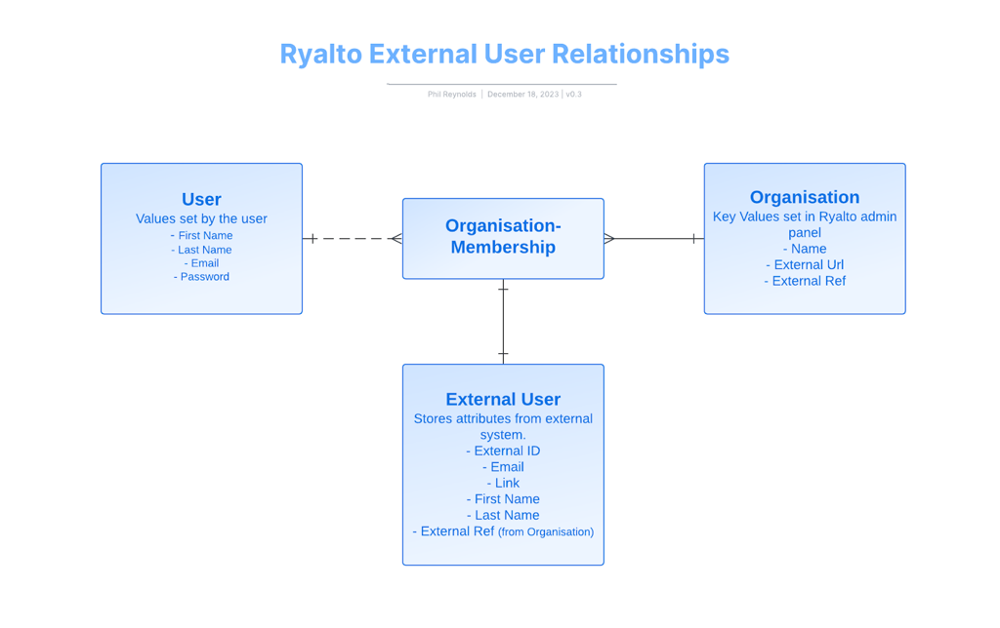

Ryalto can now act as a Security Assertion Markup Language (SAML) Identity Provider (IdP). This means that an external service can make a request to Ryalto to authenticate a user. The initial user for this is authenticating a user from Acacium’s onboarding platform JoinX.

# **Prerequisite Understanding**

A Ryalto user can be part of one or many organisations. These relationships are represented by the Organisation Membership model. When a user is connected to an external system, an External User model is attached to the Organisation Membership. The External User is intended to store reference information from the external system in Ryalto, such as the external ID, email, name and profile link.

When an organisation membership is initially created via an external system it will not be linked to a user. An email will then be sent inviting the user to join the organisation on Ryalto with a link to accept the invitation.

Please let me know if more information is required in this section -PR

- Auth model sent to external system after an SAML based SSO authentication
- The external system can choose to map based on External Id, or create its own mapping functionality based on organisation membership id or (anything other ids available) that can be exposed in the Auth response.
- User mappings via Organisation Membership Id vs top level User Id.

# **Prerequisites to SAML Authentication**

A user must be set up correctly in order to authenticate with the Ryalto SAML IdP service.

A user must have an organisation membership with an external user where the external_ref matches the reference of the SAML Service Provider reference.

At present, only the Acacium Auth0 Service is configured to use the Ryalto IdP, so **the external_ref must be “acacium”.** The SAML response will fail if the user is not correctly configured.

Note: External Ref must be set on the external user associated with the organisation membership. External User also needs a unique external ID.

# **Process Flow**

The basic process flow is outlined below.

The web URL to redirect to JoinX for Authentication is `/saml/joinx_pre_auth` 